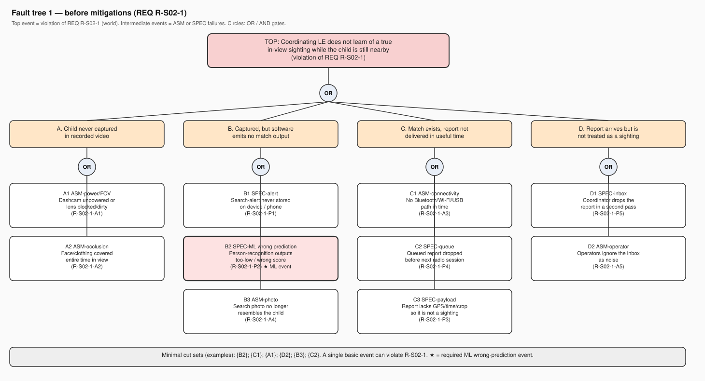
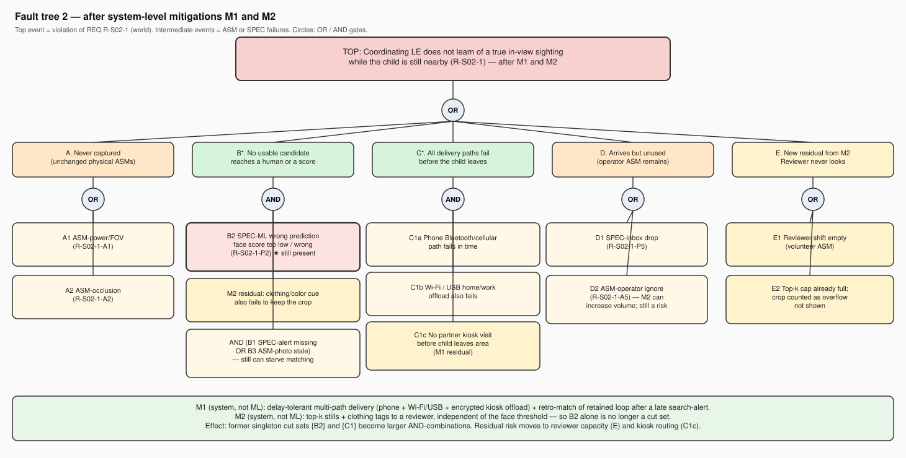

# Fault tree analysis — REQ R-S02-1

**Selected requirement (from curated result 1; depends on the ML component).** If a missing child is physically visible in the field of view of a participating dashcam during an authorized search, the coordinating law-enforcement unit learns of that co-location while the child is still in the same local area.

Top event: that REQ is violated. Intermediate events are the ASM/SPEC failures listed for R-S02-1 in `key_results.md`. The person-recognition **wrong prediction** is event B2.

## Tree 1 — before mitigations

A single basic event is enough (singleton cut sets), including `{B2}` (false negative / wrong score), `{C1}` (no radio in time), `{A1}` (camera off), `{D2}` (operators ignore the inbox). That is the point: improving only the model leaves C1/A1/D2 intact, and improving only the radio leaves B2 intact.

## Two system-level mitigations (not "more training data")

**M1 — Delay-tolerant multi-path delivery + late alert retro-match.** Treat the sighting-report as a small encrypted blob that can leave the car via (i) the paired phone, (ii) home/work Wi-Fi or USB, or (iii) a partner kiosk that is *offload only* (no forecourt camera; see S11). Independently, when a search-alert finally arrives, run matching over retained loop footage for the alert window (SPEC already implied by R-S04-2), so a child seen while the device did not yet have the photo is not lost. This does not make the radio more reliable; it makes *one* dead radio insufficient.

**M2 — Top-k human review with clothing tags, independent of the face threshold.** If the face `match_score` is below threshold but a person crop is in-scope, still emit a capped candidate still plus clothing-color tags from the search packet to the non-profit reviewer (not to a moving driver). A wrong ML prediction then has to coincide with a missed clothing cue *and* a missed reviewer. Reviewer load is capped (R-S05-3); overflow is visible as degraded coverage, not silent drop.

Neither mitigation is "collect more training data" or "buy a better backbone." Both live outside the ML component: radios/places, and a human+metadata path.

## Tree 2 — after M1 and M2

`{B2}` is no longer a cut set: B2 must AND with clothing-cue failure (and still competes with the reviewer path). `{C1}` becomes an AND of phone, Wi-Fi/USB, *and* no kiosk visit in time. Residual risk moves to reviewer staffing (new events E1/E2) and to operators ignoring a possibly larger inbox (D2) — which is why M2 must keep a hard still cap.
